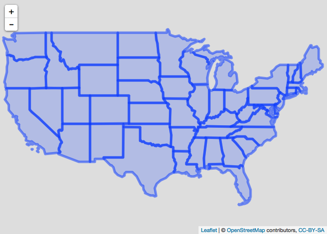

<!-- README.md is generated from README.Rmd. Please edit that file -->

# statesRcontiguous?

[](https://travis-ci.org/martinjhnhadley/statesRcontiguous)
[](https://cran.r-project.org/package=statesRcontiguous)
[](http://www.repostatus.org/#active)
[](http://cran.rstudio.com/web/packages/statesRcontiguous/index.html)

statesRcontiguous provides a tiny (small enough for CRAN) package
containing shapefiles for the following subdivisions of the United
States of
America:

| Subdivision of the US   | Shapefile/Info | Year Updated | Source                                          |
| :---------------------- | :------------- | -----------: | :---------------------------------------------- |
| States                  | Shapefile      |         2016 | <a href='' target='_blank'>US Census Bureau</a> |
| States                  | Info           |         2017 | <a href='' target='_blank'>US Census Bureau</a> |
| Congressional Districts | Shapefile      |         2016 | <a href='' target='_blank'>US Census Bureau</a> |
| Congressional Districts | Info           |         2017 | <a href='' target='_blank'>US Census Bureau</a> |
| Counties                | Shapefile      |         2016 | <a href='' target='_blank'>US Census Bureau</a> |
| Counties                | Info           |         2017 | <a href='' target='_blank'>US Census Bureau</a> |

The sources of the data in the package (and the year they were last
updated) is available from the following object:

``` r
statesRcontiguous::statesrcontiguous_shapefile_details
#> # A tibble: 6 x 5
#>   path                 subdivision    type    year source                 
#>   <chr>                <chr>          <chr>  <int> <chr>                  
#> 1 data-raw/current_st… States         Shape…  2016 http://www2.census.gov…
#> 2 data-raw/current_st… States         Info    2017 https://www2.census.go…
#> 3 data-raw/current_co… Congressional… Shape…  2016 http://www2.census.gov…
#> 4 data-raw/current_co… Congressional… Info    2017 https://www2.census.go…
#> 5 data-raw/current_co… Counties       Shape…  2016 http://www2.census.gov…
#> 6 data-raw/current_co… Counties       Info    2017 https://www2.census.go…
```

All shapefiles include a column called `contiguous.united.states` which
allows the dataset to be restricted to the contiguous US very simply:

``` r
library(statesRcontiguous)
library(leaflet)
shp_contiguous_states <- shp_all_us_states %>%
  filter(contiguous.united.states)
leaflet(shp_contiguous_states) %>%
  addTiles() %>%
  addPolygons()
#> Warning: sf layer has inconsistent datum (+proj=longlat +datum=NAD83 +no_defs).
#> Need '+proj=longlat +datum=WGS84'
```

<!-- -->

# Installation

Install from CRAN as follows:

``` r
install.packages("statesRcontiguous")
```

To install the development build of statesRcontiguous, please use the
following:

``` r
devtools::install_github("martinjhnhadley/statesRcontiguous")
```

# Should I use this package?

This package provides **only** the three shapefiles (states,
congressional districts, counties) included in the package. It is
intended for where you have a reproducible need for shapefiles for the
(contiguous) US and don’t want to have to download the files on the fly.

You might prefer to use the [tigris](https://github.com/walkerke/tigris)
package which is available on CRAN, and provides tools to download any
of the shapefiles from TIGER.

## So why does this exist?

This package was designed for the University of Oxford’s [Interactive
Data Network](http://idn.it.ox.ac.uk) which exists to provide a
visualisation service for academics at Oxford, using Shiny. The Shiny
apps developed by researchers are not allowed to contain data files,
instead data must be loaded from external DOI-issuing repositories like
[Figshare](www.figshare.com).

By providing a small utility package with these shapefiles in,
researchers can easily create choropleth of the US.

# License

This package includes shapefiles from the US Census Bureau. All
shapefiles provided by the US Census Bureau are TIGER/Line shapefiles
and are offered to the public free of charge, see [TIGER/Line Shapefil
Technical
Documentation](http://www2.census.gov/geo/pdfs/maps-data/data/tiger/tgrshp2016/TGRSHP2016_TechDoc.pdf)
for details.

This package itself is made available under the MIT license.
