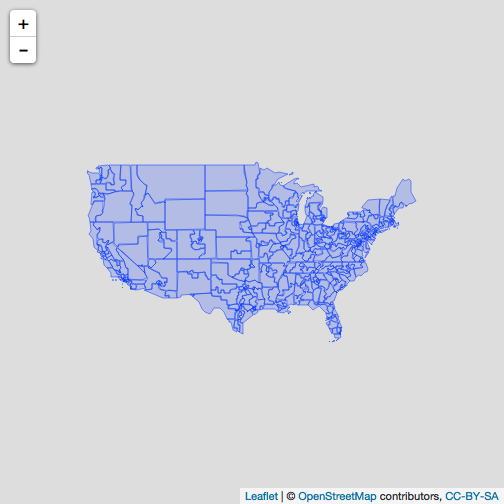

# Visualising the contiguous United States

This package provides three different shapefiles for the United States of America, comprising; state boundaries, congressional districts and counties. These are stored as `sf` objects, if you're not familiar with the excellent `sf` approach to geometric features it's highly recommended you glace at the documentation - https://r-spatial.github.io/sf//index.html

The `sf` objects contain a column called `contiguous.united.states` which allows us to restrict ourselves to only the contiguous US. This is how we might visualise the congressional districts of the contiguous US with base R:


```r
library("statesRcontiguous")
library("dplyr")
#> 
#> Attaching package: 'dplyr'
#> The following objects are masked from 'package:stats':
#> 
#>     filter, lag
#> The following objects are masked from 'package:base':
#> 
#>     intersect, setdiff, setequal, union

shp_all_us_states %>%
  filter(contiguous.united.states == TRUE) %>%
  select(geometry) %>%
  plot()
```



# Where are the shapefiles from?

All of the shapefiles in this package are from the US Census website - https://www.census.gov/geo/maps-data/data/tiger-cart-boundary.html. This package will continuously be updated with the most recent shapefiles, historical shapefiles will **not** be available in this package. If that's what you want, please do use the `tigris` package - https://github.com/walkerke/tigris.

The explicit urls for the shapefiles are available here:


```r
knitr::kable(statesrcontiguous_shapefile_details)
```


|path                                                       |subdivision             |type      | year|source                                                                   |
|:----------------------------------------------------------|:-----------------------|:---------|----:|:------------------------------------------------------------------------|
|data-raw/current_states_shapefile_url.csv                  |States                  |Shapefile | 2016|http://www2.census.gov/geo/tiger/GENZ2016/shp/cb_2016_us_state_20m.zip   |
|data-raw/current_states_info_url.csv                       |States                  |Info      | 2017|https://www2.census.gov/geo/tiger/TIGER2017/STATE/tl_2017_us_state.zip   |
|data-raw/current_congressional_districts_shapefile_url.csv |Congressional Districts |Shapefile | 2016|http://www2.census.gov/geo/tiger/GENZ2016/shp/cb_2016_us_cd115_20m.zip   |
|data-raw/current_congressional_districts_info_url.csv      |Congressional Districts |Info      | 2017|https://www2.census.gov/geo/tiger/TIGER2017/CD/tl_2017_us_cd115.zip      |
|data-raw/current_counties_shapefile_url.csv                |Counties                |Shapefile | 2016|http://www2.census.gov/geo/tiger/GENZ2016/shp/cb_2016_us_county_20m.zip  |
|data-raw/current_counties_info_url.csv                     |Counties                |Info      | 2017|https://www2.census.gov/geo/tiger/TIGER2017/COUNTY/tl_2017_us_county.zip |


